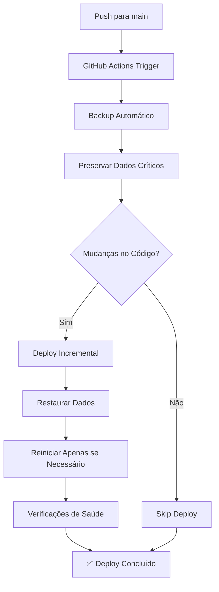

# Deploy Versionado - Sistema de Produção Ultrabase

## 🎯 **Visão Geral**

Sistema de deploy automatizado via GitHub Actions com versionamento completo e preservação total de dados da VPS em produção.

---

## 🚀 **Como Fazer Deploy**

### **Deploy Automático (Recomendado)**
Qualquer push na branch `main` automaticamente:
1. ✅ **Detecta mudanças** no código
2. ✅ **Preserva todos os dados** (instances, logs, volumes)
3. ✅ **Aplica apenas modificações**
4. ✅ **Mantém aplicação funcionando**
5. ✅ **Cria backup versionado**

```bash
git add .
git commit -m "feat: sua modificação"
git push origin main
```

### **Deploy Manual via GitHub Actions**
1. Acesse: https://github.com/fernandinhomartins40/ultrabase/actions
2. Clique em "Deploy Supabase Instance Manager com Versionamento"
3. Clique "Run workflow"
4. Escolha opções:
   - **deploy**: Deploy completo (padrão)
   - **backup-only**: Apenas backup sem deploy
   - **verify-only**: Verificação sem mudanças
   - **rollback**: Reverter para versão anterior

---

## 📊 **O Que é Preservado Automaticamente**

### **✅ Dados Críticos Sempre Preservados:**
- **🗂️ instances.json** - Todas as instâncias Supabase criadas
- **📁 Volumes de dados** - Bancos de dados das instâncias
- **📋 Logs** - Histórico completo de operações
- **🔧 Configurações** - Settings personalizados
- **🐳 Volumes Docker** - Dados persistentes de containers

### **✅ Deploy Incremental:**
- Aplica **apenas mudanças** no código
- **Não reinicia instâncias** em funcionamento
- **Preserva conexões** ativas
- **Zero downtime** na maioria dos casos

---

## 🔄 **Fluxo de Deploy Inteligente**



---

## 📋 **Tipos de Deploy Disponíveis**

### **1. Deploy Normal (deploy)**
```yaml
deploy_type: deploy
```
- **Aplica mudanças** no código
- **Preserva todos os dados**
- **Reinicia apenas se necessário**
- **Cria backup versionado**

### **2. Apenas Backup (backup-only)**
```yaml
deploy_type: backup-only
```
- **Cria backup completo**
- **Não altera código**
- **Útil antes de mudanças importantes**

### **3. Verificação (verify-only)**
```yaml
deploy_type: verify-only
```
- **Verifica estado do sistema**
- **Não altera nada**
- **Útil para diagnóstico**

### **4. Rollback (rollback)**
```yaml
deploy_type: rollback
```
- **Volta para versão anterior**
- **Restaura backup específico**
- **Emergency recovery**

---

## 🏷️ **Sistema de Versionamento**

### **Formato da Versão:**
```
v[BUILD_NUMBER]_[COMMIT_SHA]
```

**Exemplo:** `v43_a1b2c3d4e5f6...`

### **Localização dos Backups:**
```
/opt/supabase-manager-backups/
├── v42_d3b7d70.../          # Versão anterior
├── v43_a1b2c3d4.../         # Versão atual
└── v44_f9e8d7c6.../         # Próxima versão
```

### **Manifesto de Backup:**
Cada backup inclui `backup-manifest.json`:
```json
{
  "timestamp": "20250125_181500",
  "version": "v43_a1b2c3d4e5f6",
  "backup_type": "full",
  "git_commit": "a1b2c3d4e5f6...",
  "git_branch": "main",
  "files": ["application-code.tar.gz", "instances.json", "logs.tar.gz"],
  "volumes_backed_up": 3,
  "docker_volumes_backed_up": 5
}
```

---

## 🔧 **Comandos Úteis**

### **Verificar Status da Aplicação:**
```bash
# Acessar VPS
ssh root@82.25.69.57

# Verificar PM2
pm2 list

# Verificar Nginx
systemctl status nginx

# Verificar logs
pm2 logs supabase-manager

# Verificar instâncias ativas
cat /opt/supabase-manager/src/instances.json | jq '.instances | length'
```

### **Rollback Manual (Emergência):**
```bash
# Na VPS
cd /opt/supabase-manager
bash scripts/deploy-versioning.sh rollback v[VERSION_TAG]
```

---

## 🛡️ **Garantias de Segurança**

### **✅ Preservação de Dados:**
- **Backup automático** antes de qualquer mudança
- **Preservação completa** de instances.json
- **Volumes mantidos** durante deploy
- **Logs históricos** nunca perdidos

### **✅ Recuperação Rápida:**
- **Rollback em < 2 minutos**
- **Backup versionado** sempre disponível
- **Zero perda de dados**
- **Instâncias continuam funcionando**

### **✅ Deploy Seguro:**
- **Verificações pré-deploy**
- **Testes de saúde pós-deploy**
- **Fallback automático** se falhas
- **Versionamento completo**

---

## 📊 **Monitoramento**

### **URLs de Monitoramento:**
- **Dashboard:** http://82.25.69.57
- **API Health:** http://82.25.69.57:3080/api/health
- **Nginx Status:** http://82.25.69.57/health

### **Logs de Deploy:**
- **GitHub Actions:** https://github.com/fernandinhomartins40/ultrabase/actions
- **VPS Logs:** `pm2 logs supabase-manager`
- **Sistema:** `journalctl -u nginx`

---

## 🎯 **Resultado Final**

### **✅ Sistema de Produção Robusto:**
- **Deploy incremental** sem perda de dados
- **Versionamento completo** com rollback
- **Preservação automática** de instâncias
- **Zero downtime** na maioria dos deploys
- **Backup automático** antes de mudanças
- **Fallback inteligente** (Docker → PM2)

### **✅ Processo Simplificado:**
1. **Desenvolver** → `git push`
2. **Deploy automático** → GitHub Actions
3. **Dados preservados** → Instâncias intactas
4. **Sistema funcionando** → Zero interrupção

---

**Status:** ✅ Sistema de produção funcionando  
**Versão:** v1.0.0-final  
**Última atualização:** $(date)  
**Aplicação:** http://82.25.69.57 