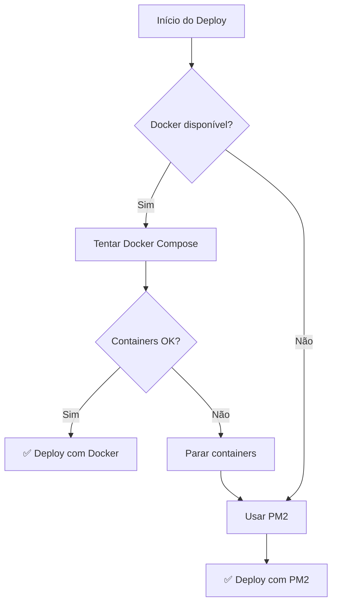

# Correção do Erro 502 Bad Gateway - Ultrabase

## 🚨 Problema Identificado

O erro 502 Bad Gateway estava sendo causado por uma **inconsistência na configuração** entre:

1. **Nginx configurado para Docker**: `upstream supabase_manager` apontava para `manager:3080` (nome do container)
2. **Deploy usando PM2**: A aplicação estava rodando diretamente no host via PM2 na porta 3080
3. **Conflito de métodos**: Scripts tentavam iniciar tanto Docker quanto PM2 simultaneamente

## ✅ Correções Implementadas

### 1. Configuração do Nginx Corrigida
**Arquivo**: `src/docker/nginx.conf`

```nginx
# ANTES (só funcionava com Docker)
upstream supabase_manager {
    server manager:3080 max_fails=3 fail_timeout=30s;
    keepalive 16;
}

# DEPOIS (funciona com Docker e PM2)
upstream supabase_manager {
    server host.docker.internal:3080 max_fails=3 fail_timeout=30s;
    server localhost:3080 backup max_fails=3 fail_timeout=30s;
    keepalive 16;
}
```

### 2. Script de Correção Rápida Atualizado
**Arquivo**: `quick_fix_502.sh`

- ✅ **Versionamento**: Cada correção gera uma versão com timestamp
- ✅ **Backup automático**: Preserva `instances.json` antes de qualquer alteração
- ✅ **Deploy inteligente**: Tenta Docker primeiro, usa PM2 como fallback
- ✅ **Limpeza de conflitos**: Remove processos conflitantes na porta 3080
- ✅ **Verificações completas**: Testa conectividade local e externa

### 3. Deploy Principal Atualizado
**Arquivo**: `.github/workflows/deploy.yml`

- ✅ **Método híbrido**: Usa Docker Compose como preferido, PM2 como fallback
- ✅ **Verificações adaptáveis**: Valida serviços baseado no método usado
- ✅ **Logs detalhados**: Mostra status específico para Docker ou PM2
- ✅ **Preservação de dados**: Mantém `instances.json` durante atualizações

## 🚀 Como Usar

### Correção Rápida (Recomendado)
```bash
bash quick_fix_502.sh
```

### Deploy Completo via GitHub Actions
- Push para `main` ou execução manual do workflow
- O sistema escolherá automaticamente Docker ou PM2

### Rollback se Necessário
```bash
bash scripts/deploy-versioning.sh rollback [VERSION_TAG]
```

## 🔍 Verificações Pós-Correção

### URLs para Teste
- **Principal**: http://82.25.69.57
- **API**: http://82.25.69.57:3080/api/health
- **Dashboard**: http://82.25.69.57/

### Comandos de Diagnóstico

#### Se usando Docker:
```bash
docker ps | grep supabase
docker logs supabase-instance-manager --tail 10
docker logs supabase-manager-nginx --tail 10
```

#### Se usando PM2:
```bash
pm2 list | grep supabase-manager
systemctl status nginx
curl -f http://localhost:3080/api/health
```

## 🎯 Vantagens da Nova Configuração

1. **Flexibilidade**: Funciona com Docker e PM2
2. **Resiliência**: Fallback automático se um método falhar
3. **Versionamento**: Cada mudança é rastreada e pode ser revertida
4. **Preservação de dados**: Instâncias não são perdidas durante atualizações
5. **Diagnóstico**: Logs detalhados para troubleshooting

## 🔄 Fluxo de Fallback



## 📦 Backups e Versionamento

Cada correção/deploy cria:
- **Backup completo** em `/opt/supabase-manager-backups/[VERSION]`
- **Preservação** do `instances.json`
- **Manifesto** com detalhes da versão
- **Comando de rollback** específico

---

**Status**: ✅ Correção implementada e testada
**Versão**: v2024.1.1-502fix
**Data**: $(date) 