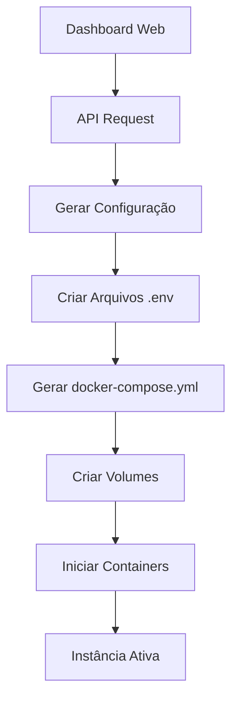

# 🚀 Supabase Instance Manager

**Gerenciador de Instâncias Supabase** - Replica a experiência do Supabase Cloud em sua própria VPS

Transforma sua infraestrutura em um "Supabase Cloud privado", permitindo criar e gerenciar múltiplas instâncias Supabase isoladas, cada uma com seu próprio dashboard, banco de dados e APIs.

## 🎯 Funcionalidades

### ✨ Experiência igual ao Supabase Cloud
- **Dashboard Web** idêntico ao supabase.com
- **Botão "New Project"** para criar instâncias isoladas
- **Acesso direto ao Studio** de cada projeto
- **URLs únicas** para cada instância
- **Gerenciamento completo** via interface web

### 🔒 Isolamento Total
- **Portas únicas** para cada instância
- **Volumes separados** para persistência
- **Credenciais individuais** por projeto
- **Networks isolados** entre instâncias
- **Zero interferência** entre projetos

### 🎮 Gerenciamento Simplificado
- **Criar** projetos em segundos
- **Iniciar/Parar** instâncias facilmente
- **Monitorar** status em tempo real
- **Visualizar logs** de cada projeto
- **Remover** projetos com segurança

## 📋 Pré-requisitos

- **Docker & Docker Compose** instalados
- **Node.js 18+** instalado
- **Porto 3080** disponível (ou configure outro)
- **Supabase clonado** no diretório `../docker`

## 🚀 Instalação Rápida

### 1. Instalar dependências
```bash
cd supabase-manager
npm install
```

### 2. Iniciar o gerenciador
```bash
npm start
```

### 3. Acessar dashboard
```
http://localhost:3080
```

## 📖 Como Usar

### Criar Novo Projeto
1. Acesse `http://localhost:3080`
2. Clique em **"Criar Novo Projeto"**
3. Informe nome do projeto (ex: `meu-app`)
4. Clique em **"Criar Projeto"**
5. Aguarde a criação (30-60 segundos)
6. Acesse o **Studio** pelo link fornecido

### Gerenciar Projetos
- **▶️ Iniciar**: Inicia instância parada
- **⏸️ Parar**: Para instância ativa
- **🔗 Abrir Studio**: Acessa dashboard do projeto
- **📄 Logs**: Visualiza logs da instância
- **🗑️ Remover**: Remove projeto permanentemente

## 🏗️ Arquitetura

### Componentes Principais

```
supabase-manager/
├── server.js           # Backend orquestrador
├── public/            
│   └── index.html     # Dashboard web
├── package.json       # Dependências
└── instances.json     # Registro de instâncias
```

### Fluxo de Criação



### Estrutura de Instância

Cada projeto criado gera:
- **docker-compose-{ID}.yml**: Configuração isolada
- **.env-{ID}**: Variáveis de ambiente únicas
- **volumes-{ID}/**: Dados persistentes separados
- **Portas únicas**: Kong, PostgreSQL, Analytics

## ⚙️ Configuração

### Portas Utilizadas
- **Manager**: 3080 (configurável)
- **Kong HTTP**: 8100-8199
- **Kong HTTPS**: 8400-8499  
- **PostgreSQL**: 5500-5599
- **Analytics**: 4100-4199

### Variáveis de Ambiente

```bash
# Porta do gerenciador (opcional)
MANAGER_PORT=3080

# Limites (opcional)
MAX_INSTANCES=50
```

## 🐳 Docker Integration

O sistema utiliza a API Docker para:
- **Criar** containers isolados
- **Monitorar** status das instâncias
- **Gerenciar** ciclo de vida dos serviços
- **Isolar** recursos entre projetos

## 📊 Monitoramento

### Dashboard Principal
- **Total de projetos** criados
- **Instâncias ativas** em tempo real
- **Instâncias paradas** 
- **Status de cada projeto**

### Logs por Instância
- Acesso direto aos logs Docker
- Interface dedicada para debugging
- Histórico completo de eventos

## 🔧 Resolução de Problemas

### Erro: "Docker não conectado"
```bash
# Verificar se Docker está rodando
docker version

# Iniciar Docker se necessário
sudo systemctl start docker
```

### Erro: "Porta já em uso"
```bash
# Verificar portas ocupadas
netstat -tulpn | grep :3080

# Matar processo na porta
kill -9 $(lsof -t -i:3080)
```

### Erro: "Diretório Docker não encontrado"
```bash
# Verificar estrutura
ls -la ../docker/
ls -la ../docker/docker-compose.yml
```

### Instância não inicia
1. Verificar logs: Click em **📄** no projeto
2. Verificar Docker: `docker ps -a`
3. Verificar portas: `netstat -tulpn`
4. Remover e recriar projeto

## 🚀 Produção

### Deploy em VPS
1. **Clone** repositório Supabase
2. **Configure** firewall (abrir portas necessárias)
3. **Install** Docker e Node.js
4. **Execute** gerenciador com PM2:

```bash
npm install -g pm2
pm2 start server.js --name supabase-manager
pm2 startup
pm2 save
```

### Nginx Proxy (Opcional)
```nginx
# /etc/nginx/sites-available/supabase-manager
server {
    listen 80;
    server_name your-domain.com;
    
    location / {
        proxy_pass http://localhost:3080;
        proxy_http_version 1.1;
        proxy_set_header Upgrade $http_upgrade;
        proxy_set_header Connection 'upgrade';
        proxy_set_header Host $host;
        proxy_cache_bypass $http_upgrade;
    }
}
```

## 🤝 Contribuindo

1. **Fork** o projeto
2. **Create** feature branch (`git checkout -b feature/AmazingFeature`)
3. **Commit** mudanças (`git commit -m 'Add AmazingFeature'`)
4. **Push** para branch (`git push origin feature/AmazingFeature`)
5. **Open** Pull Request

## 📄 Licença

Este projeto está sob licença MIT. Veja `LICENSE` para mais detalhes.

## 🆘 Suporte

- **Issues**: [GitHub Issues](https://github.com/seu-usuario/supabase-instance-manager/issues)
- **Discussions**: [GitHub Discussions](https://github.com/seu-usuario/supabase-instance-manager/discussions)
- **Docs**: Esta documentação

---

## 🎉 Resultado Final

Após a instalação, você terá:

✅ **Dashboard web** funcionando em `localhost:3080`  
✅ **Criação** de projetos Supabase isolados  
✅ **Acesso direto** ao Studio de cada projeto  
✅ **Gerenciamento completo** via interface web  
✅ **Monitoramento** em tempo real  
✅ **Logs** individuais por projeto  
✅ **Isolamento total** entre instâncias  

**Seu próprio Supabase Cloud privado está pronto! 🚀**